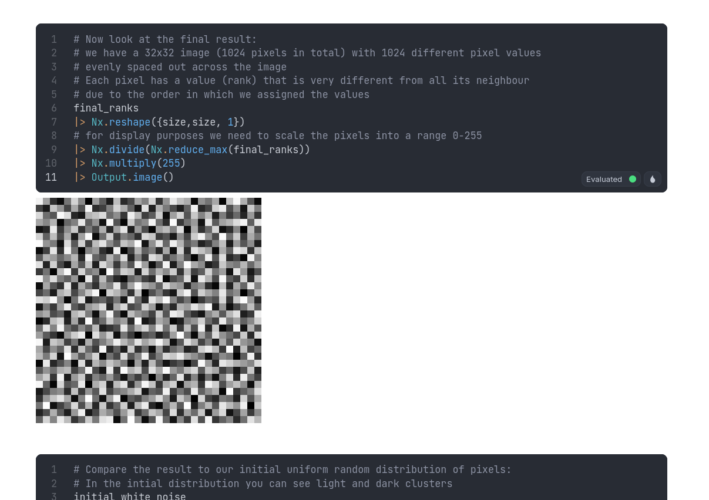

# Generating Blue Noise in Elixir with Nx

## Preface

This livebook shows how to generate 2-dimensional blue noise via Elixir Nx.

This is a translation from Python to Elixir of [the original Python/Numpy version](https://static.laszlokorte.de/blue-noise/)

## Introduction

[Video Demo](https://www.youtube.com/watch?v=ORsTjpy5CH8) | [Jupyter Notebook with further examples](https://github.com/laszlokorte/bluenoise-notebook/blob/main/bluenoise.ipynb) This is an interactive demonstration of the [Void and Cluster](https://ieeexplore.ieee.org/document/3288/) algorithm for generating blue noise. [There are](http://momentsingraphics.de/BlueNoise.html) already [plenty of](https://observablehq.com/@bensimonds/mitchells-best-candidate-algorithm) excellent explorations on [how](https://blog.demofox.org/2019/06/25/generating-blue-noise-textures-with-void-and-cluster/) [and why](https://www.youtube.com/watch?v=tethAU66xaA) to generate [blue noise](https://en.wikipedia.org/wiki/Colors_of_noise), [and noises of other color](https://blog.demofox.org/2017/10/25/transmuting-white-noise-to-blue-red-green-purple/). The _Void and Cluster_ algorithm is one of [several promiment algorithms](https://blog.demofox.org/2017/10/20/generating-blue-noise-sample-points-with-mitchells-best-candidate-algorithm/). [Some advantages](https://blog.demofox.org/2018/08/12/not-all-blue-noise-is-created-equal/) over other algorithms are that the blue noise is of very good quality and that only the first step in the algorithm is non-deterministic.

### This livebook

The goal of this livebook is to provide additional insight by visualizing the core idea of this algorithm.

This insight might be used to better unstand the algorithm itself, for example to recognize potential performance improvements. But it might also be used as source of inspiration on how to design a custom algorithm. The algorithm below is implemented in Nx using an array oriented style. In this regard it can also be used as a case-study on how a sophisticated algorithm (that may [take multiple hundred lines in C++](https://github.com/Atrix256/VoidAndCluster/blob/master/generatebn_void_cluster.cpp)) can be written very succinctly when relying on higher level concepts, such as convolution and rank-polymorphism.
